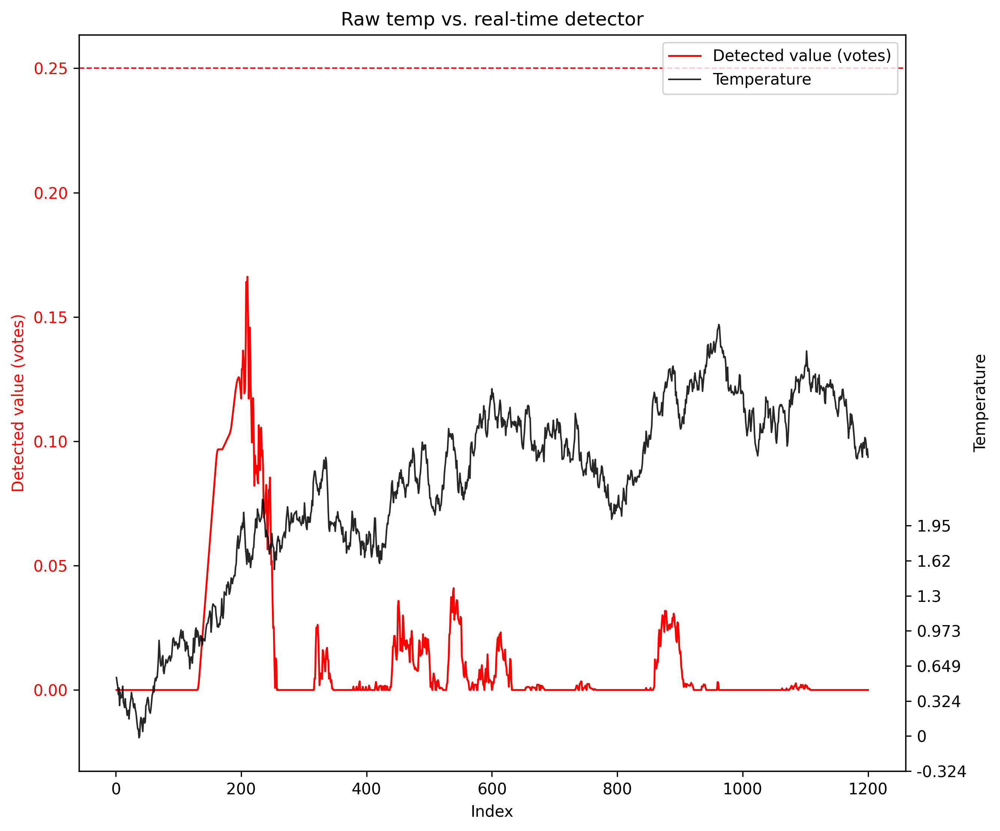

# rollsvd-tools

A small utility library that provides:

-   Rolling/expanding window index construction (`roll_windows`)
-   Rolling SVD (eigendecomposition) of per-window covariance (`roll_svd`)
-   ARIMAX fitting and batch residual extraction (`fit_arimax_vec`, `arimax_residuals_df`)
-   Pipelines that combine ARIMAX residualization + rolling SVD (`arimax_then_roll_svd`)
-   Signal builders and multi-scale slope-vote change detectors (`detect_asvotes`, `detect_realtime`)
-   Simple plotting utilities (`plot_detection_overlay`)

## Install (editable, for development)

``` bash
python -m pip install -U pip
python -m pip install -e ".[dev,arima,fast]"
```

If you do not need ARIMAX functionality, omit `arima`. If you do not need sparse/fast eigensolvers, omit `fast`.

## Run tests

``` bash
# Reproducibility (R's set.seed(1))
np.random.seed(1)

n = 1200
df = pd.DataFrame({
    "time": np.arange(1, n + 1),
    "temp": np.cumsum(np.random.normal(loc=0.0, scale=0.02, size=n)),
})

sig_raw = build_signal_raw(df, time="time", col="temp")

det_raw = detect_realtime(
    time=sig_raw["time_ind"].to_numpy(),
    signal=sig_raw["signal"].to_numpy(),
    lowwl=5,
    highwl="auto",
    mad_k=3,
    direction="positive",
    burn_in=200,
    smooth_k=30,
    threshold=0.25,
)

# Plot (left axis = detector, right axis = original signal)
fig, ax1, ax2 = plot_detection_overlay(
    det_raw,
    title="Raw temp vs. real-time detector",
    score_label="Detected value (votes)",
    signal_label="Temperature",
    x_label="Index",
    threshold=0.25,
)
```


